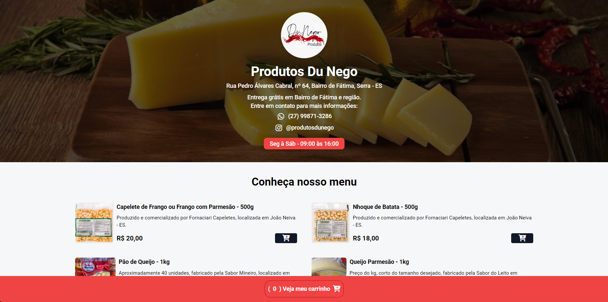
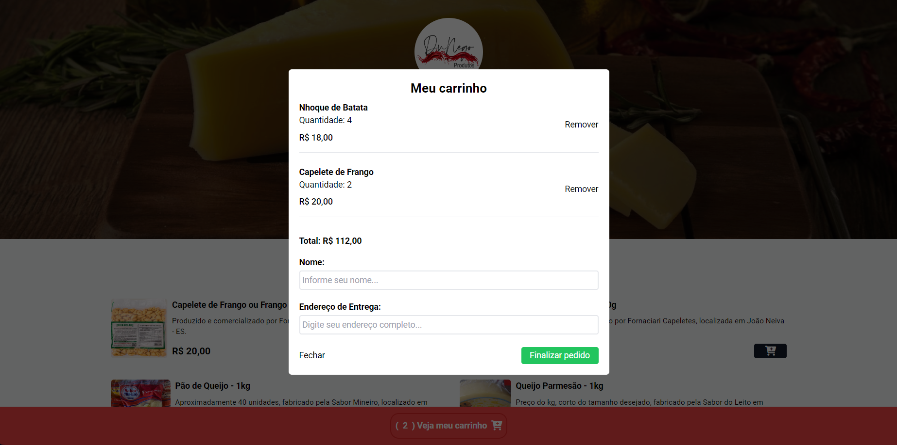

<h1 align="center" style="font-weight: bold;">Produtos Du Nego </h1>

    <b>Site cardápio com envio do pedido por mensagem via WhatsApp</b> 

   Feito utilizando:  
    
    
    

     <a href="https://produtosdunego.vercel.app">Visite este projeto</a>

## Imagens da página:

    
    

