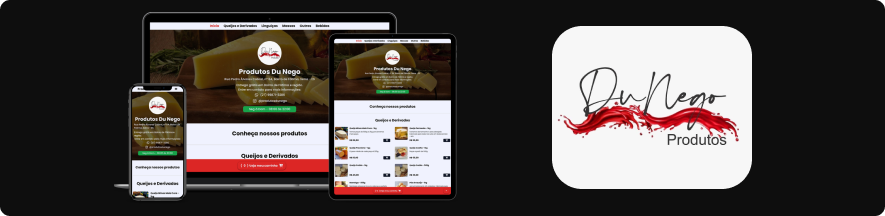

<h1 align="center" style="font-weight: bold;">Produtos Du Nego </h1>

<p align="center">
    <b>Site cardápio com envio do pedido por mensagem via WhatsApp</b><br><br>
    <b>Possui controle dos dias da semana e horário de funcionamento, quando fora dos dias e dos horários estipulados o cliente não consegue enviar um pedido</b>

##
<br>

<div align="center">
   Feito utilizando:  
    
    
    
</div>
</p>

<p align="center">
     <a href="https://produtosdunego.vercel.app">Visite este projeto</a>
</p>

##

### ⚙️ Pré-requisitos

Necessário ter Node.js instalado, para verificar digite no seu terminal.

```bash
node -v
```
Caso não tenha instalado, faça download no site [nodejs.org](https://nodejs.org).

### 🔨 Guia de instalação

Abra o terminal na pasta em que deseja instalar o projeto e execute:
```bash
git clone https://github.com/Igorx26/ProdutosDuNego.git
```
Entre na pasta ProdutosDuNego:
```bash
cd ProdutosDuNego
```
Instale as dependências:
```bash
npm install
```
Rode o projeto:
```bash
npm run dev
```

## 📄 Licença

Esse projeto está sob a licença MIT License - acesse os detalhes [LICENSE.md](https://github.com/Igorx26/ProdutosDuNego/blob/main/LICENSE).